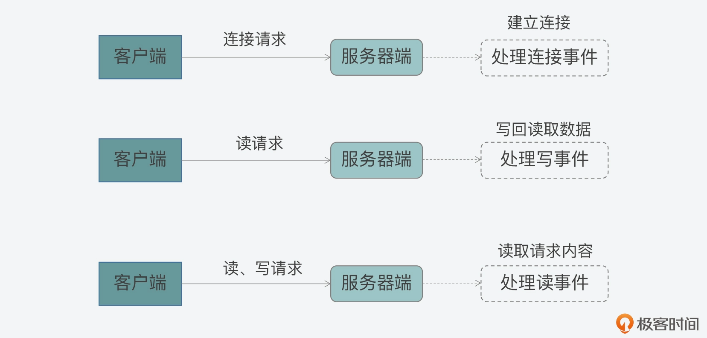
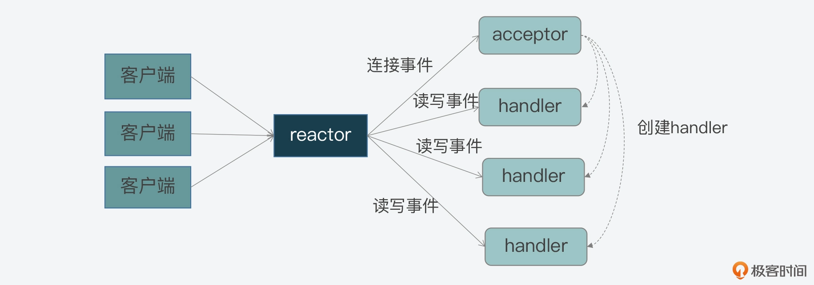
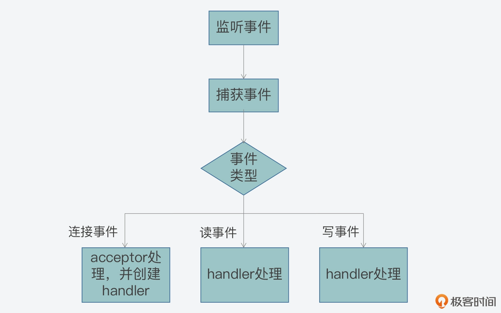
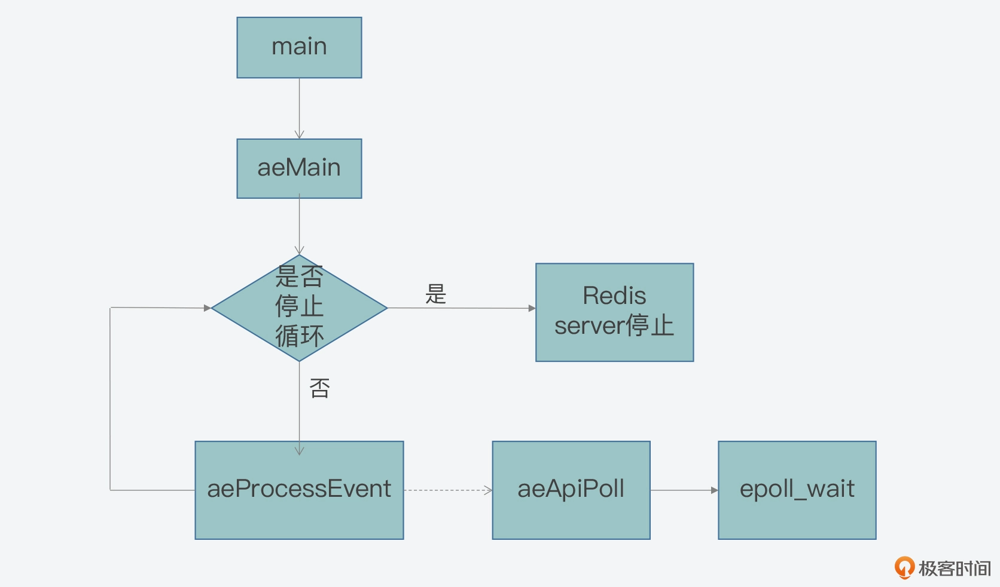
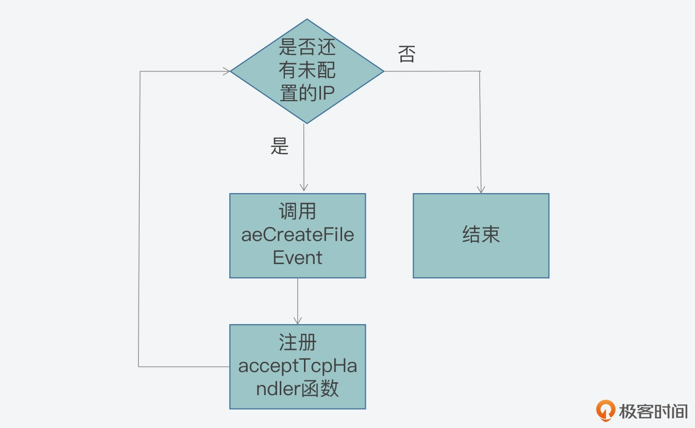
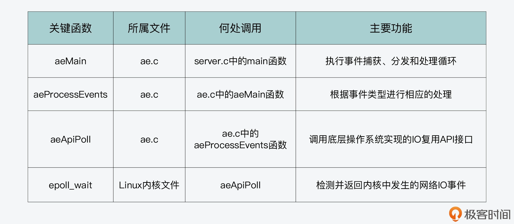
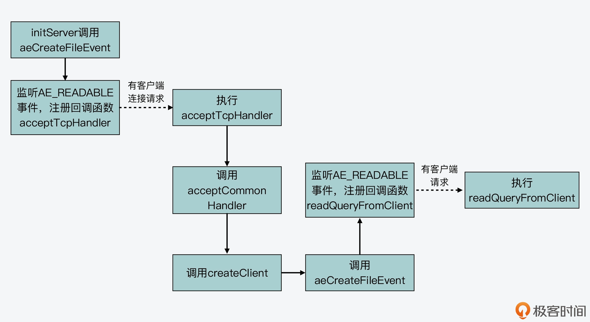
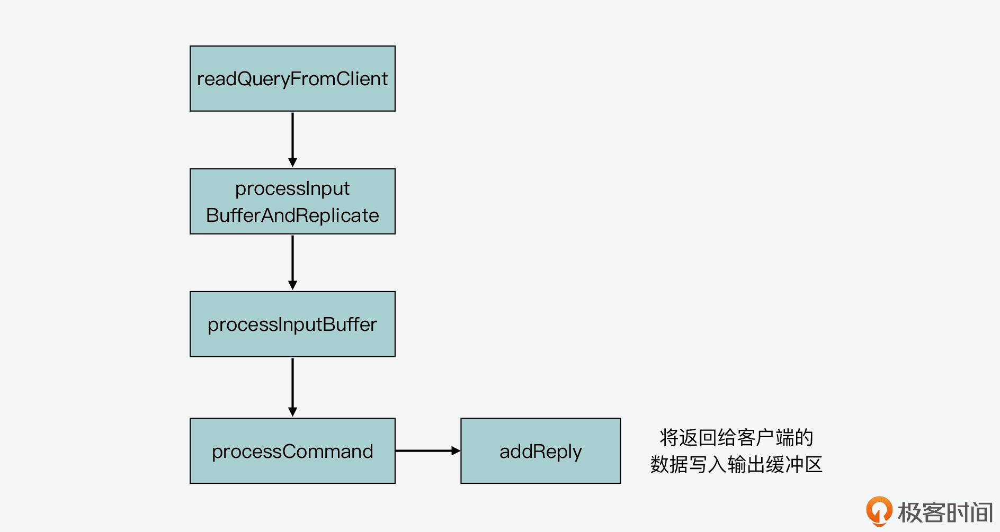
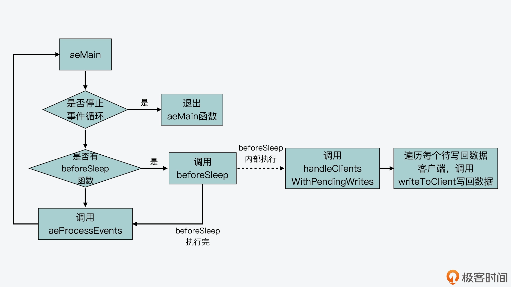

### Reactor模型

Reactor模型就是网络服务器端用来处理高并发网络IO请求的一种编程模型。关键点：

- 三类关键事件：连接事件/写事件/读事件。
- 三个关键角色：reactor/acceptor/handler。

Reactor模型处理的是客户端和服务器端的交互过程，而这三类事件正好对应了客户端和服务器端交互过程中，不同类请求在服务器端引发的待处理事件。

- 当一个客户端要和服务器端进行交互时，客户端就会向服务器端发送连接请求，以建立连接，这就对应了服务器端的一个**连接事件**。
- 一旦建立连接以后，客户端就会给服务器端发送读请求，以便读取数据。服务器端在处理读请求时，需要向客户端写回数据，这就对应了服务器端的
  **写事件**。
- 无论客户端给服务器端发送读或写请求，服务器端都需要从客户端读去请求内容，所以在这里，读或写请求的读取就对应了服务器端的**读事件**。



三个关键角色的作用：

- 首先，连接事件由 acceptor 来处理，负责接收连接；acceptor 在接收连接后，会创建 handler，用于网络连接上对后续读写事件的处理；
- 其次，读写事件由 handler 处理；
- 最后，在高并发场景中，连接事件、读写事件会同时发生，所以，我们需要有一个角色专门监听和分配事件，这就是 reactor
  角色。当有连接请求时，reactor 将产生的连接事件交由 acceptor 处理；当有读写请求时，reactor 将读写事件交由 handler 处理。



### 事件驱动框架

所谓的事件驱动框架，就是在实现Reactor模型时，需要实现的代码整体控制逻辑。简单来说，事件驱动框架包括了两部分：

- 事件初始化
- 事件捕获/分发/处理主循环

事件初始化是在服务器启动时就执行的，主要是创建需要监听的事件类型，以及该类事件对应的handler。服务器完成初始化后，事件初始化也就完成了，服务器程序就需要进入到事件的捕获/分发/处理主循环中。

在实际的开发过程中，通常会使用while循环来作为这个主循环，在这个循环中，要捕获发生的事件，然后根据事件类型来调用在初始化时创建好的
**事件hanler**完成处理。

流程图如下：


### Redis 对 Reactor 模型的实现

Redis 的网络框架实现了 Reactor 模型，并且自行开发实现了一个事件驱动框架。这个框架对应的 Redis 代码实现文件是ae.c，对应的头文件是ae.h。

事件驱动框架的实现离不开事件的定义，以及事件注册、捕获、分发和处理等一系列操作。当然，对于整个框架来说，还需要能一直运行，持续地响应发生的事件。

从 ae.h 头文件中就可以看到，Redis 为了实现事件驱动框架，相应地定义了事件的数据结构、框架主循环函数、事件捕获分发函数、事件和
handler 注册函数。

事件的数据结构是关联事件类型和事件处理函数的关键要素，而 Redis 的事件驱动框架定义了两类事件：IO 事件和时间事件，分别对应了客户端发送的网络请求和
Redis 自身的周期性操作。

事件的数据结构定义：以 aeFileEvent 为例

```
// 
typedef struct aeFileEvent {
    int mask; /* one of AE_(READABLE|WRITABLE|BARRIER) */
    aeFileProc *rfileProc;
    aeFileProc *wfileProc;
    void *clientData;
} aeFileEvent;
```

- mask 是用来表示事件类型的掩码。对于网络通信的事件来说，主要有 AE_READABLE、AE_WRITABLE 和 AE_BARRIER
  三种类型事件。框架在分发事件时，依赖的就是结构体中的事件类型；
- rfileProc 和 wfileProce 分别是指向 AE_READABLE 和 AE_WRITABLE 这两类事件的处理函数，也就是 Reactor 模型中的
  handler。框架在分发事件后，就需要调用结构体中定义的函数进行事件处理；
- 最后一个成员变量 clientData 是用来指向客户端私有数据的指针；

Redis 在 ae.h 文件中，定义了支撑框架运行的主要函数，包括框架主循环的 aeMain 函数、负责事件捕获与分发的 aeProcessEvents
函数，以及负责事件和 handler 注册的 aeCreateFileEvent 函数，它们的原型定义如下：

```
void aeMain(aeEventLoop *eventLoop);
int aeCreateFileEvent(aeEventLoop *eventLoop, int fd, int mask, aeFileProc *proc, void *clientData);
int aeProcessEvents(aeEventLoop *eventLoop, int flags);
```

#### 主循环：aeMain 函数

aeMain 函数的逻辑很简单，就是用一个循环不停地判断事件循环的停止标记。如果事件循环的停止标记被设置为
true，那么针对事件捕获、分发和处理的整个主循环就停止了；否则，主循环会一直执行。aeMain 函数的主体代码如下所示：

```
void aeMain(aeEventLoop *eventLoop) {
    eventLoop->stop = 0;
    while (!eventLoop->stop) {
        …
        aeProcessEvents(eventLoop, AE_ALL_EVENTS|AE_CALL_AFTER_SLEEP);
    }
}
```

aeMain 函数是在哪里被调用?

按照事件驱动框架的编程规范来说，框架主循环是在服务器程序初始化完成后，就会开始执行。

Redis 在完成 Redis server 的初始化后，会调用 aeMain 函数开始执行事件驱动框架。

#### 事件捕获与分发：aeProcessEvents 函数

aeMain 函数包含了事件框架的主循环，在主循环中通过 aeProcessEvents 来完成事件的捕获/分发/处理。

aeProcessEvents 函数实现的主要功能，包括捕获事件、判断事件类型和调用具体的事件处理函数，从而实现事件的处理。

aeProcessEvents 函数的主体结构中有三个if条件分支：

```
int aeProcessEvents(aeEventLoop *eventLoop, int flags)
{
    int processed = 0, numevents;
 
    /* 若没有事件处理，则立刻返回*/
    if (!(flags & AE_TIME_EVENTS) && !(flags & AE_FILE_EVENTS)) return 0;
    /*如果有IO事件发生，或者紧急的时间事件发生，则开始处理*/
    if (eventLoop->maxfd != -1 || ((flags & AE_TIME_EVENTS) && !(flags & AE_DONT_WAIT))) {
       …
    }
    /* 检查是否有时间事件，若有，则调用processTimeEvents函数处理 */
    if (flags & AE_TIME_EVENTS)
        processed += processTimeEvents(eventLoop);
    /* 返回已经处理的文件或时间*/
    return processed; 
}
```

这三个分支分别对应了以下三种情况:

- 情况一：既没有时间事件，也没有网络事件；
- 情况二：有 IO 事件或者有需要紧急处理的时间事件；
- 情况三：只有普通的时间事件。

那么对于第一种情况来说，因为没有任何事件需要处理，aeProcessEvents 函数就会直接返回到 aeMain
的主循环，开始下一轮的循环；而对于第三种情况来说，该情况发生时只有普通时间事件发生，所以 aeMain 函数会调用专门处理时间事件的函数
processTimeEvents，对时间事件进行处理。

第二种情况，Redis 需要捕获发生的网络事件，并进行相应的处理。Redis会调用aeApiPoll 来捕获事件。

```
int aeProcessEvents(aeEventLoop *eventLoop, int flags){
   ...
   if (eventLoop->maxfd != -1 || ((flags & AE_TIME_EVENTS) && !(flags & AE_DONT_WAIT))) {
       ...
       //调用aeApiPoll函数捕获事件
       numevents = aeApiPoll(eventLoop, tvp);
       ...
    }
    ...
```

aeApiPoll 是如何捕获事件?

Redis 是依赖于操作系统底层提供的 IO 多路复用机制，来实现事件捕获，检查是否有新的连接、读写事件发生。对于不同的系统，
redis做了不同的封装。

这里用Linux来做示例：Linux 上提供了 epoll_wait API，用于检测内核中发生的网络 IO 事件。在ae_epoll.c文件中，aeApiPoll 函数就是封装了对
epoll_wait 的调用。
在 aeApiPoll 函数中直接调用了 epoll_wait 函数，并将 epoll 返回的事件信息保存起来的逻辑：

```
static int aeApiPoll(aeEventLoop *eventLoop, struct timeval *tvp) {
    …
    //调用epoll_wait获取监听到的事件
    retval = epoll_wait(state->epfd,state->events,eventLoop->setsize,
            tvp ? (tvp->tv_sec*1000 + tvp->tv_usec/1000) : -1);
    if (retval > 0) {
        int j;
        //获得监听到的事件数量
        numevents = retval;
        //针对每一个事件，进行处理
        for (j = 0; j < numevents; j++) {
             #保存事件信息
        }
    }
    return numevents;
}
```

现在我们就已经在 aeMain 函数中，看到了 aeProcessEvents 函数被调用，并用于捕获和分发事件的基本处理逻辑.


#### 事件注册：aeCreateFileEvent 函数

在初始化过程中，aeCreateFileEvent 会被调用，用于注册要监听的事件，以及相应的事件处理函数。

在 initServer 函数的执行过程中，initServer 函数会根据启用的 IP 端口个数，为每个 IP 端口上的网络事件，调用
aeCreateFileEvent，创建对 AE_READABLE 事件的监听，并且注册 AE_READABLE 事件的处理 handler，也就是 acceptTcpHandler
函数。这一过程如下图所示：


AE_READABLE 事件就是客户端的网络连接事件，而对应的处理函数就是接收 TCP 连接请求。

aeCreateFileEvent 如何实现事件和处理函数的注册呢？

Linux 提供了 epoll_ctl API，用于增加新的观察事件。而 Redis 在此基础上，封装了 aeApiAddEvent 函数，对 epoll_ctl
进行调用。aeCreateFileEvent 就会调用 aeApiAddEvent，然后 aeApiAddEvent 再通过调用 epoll_ctl，来注册希望监听的事件和相应的处理函数。等到
aeProceeEvents 函数捕获到实际事件时，它就会调用注册的函数对事件进行处理了。



问题：

- epoll_wait 为什么返回的是已就绪事件的数量？

### aeEventLoop 结构体与初始化

主要记录了两类事件：

- aeFileEvent 类型的指针 *events，表示 IO 事件。之所以类型名称为 aeFileEvent，是因为所有的 IO 事件都会用文件描述符进行标识；
- aeTimeEvent 类型的指针 *timeEventHead，表示时间事件，即按一定时间周期触发的事件。
- aeFiredEvent 类型的指针 *fired 这个并不是一类专门的事件类型，它只是用来记录已触发事件对应的文件描述符信息。

```
    typedef struct aeEventLoop {
        …
        aeFileEvent *events; //IO事件数组
        aeFiredEvent *fired; //已触发事件数组
        aeTimeEvent *timeEventHead; //记录时间事件的链表头
        …
        void *apidata; //和API调用接口相关的数据
        aeBeforeSleepProc *beforesleep; //进入事件循环流程前执行的函数
        aeBeforeSleepProc *aftersleep;  //退出事件循环流程后执行的函数
    } aeEventLoop;
```

aeEventLoop于initServer中完成初始化

```
    initServer() {
        …
        //调用aeCreateEventLoop函数创建aeEventLoop结构体，并赋值给server结构的el变量
        server.el = aeCreateEventLoop(server.maxclients+CONFIG_FDSET_INCR);
        …
    }
```

aeCreateEventLoop有一个参数setsize, 这个参数的作用？
答：决定事件驱动能够处理的最大文件描述符数量，同时决定了和 Redis server 连接的客户端数量。

aeCreateEventLoop执行步骤：

- aeCreateEventLoop 函数会创建一个 aeEventLoop 结构体类型的变量 eventLoop。给变量进行内存分配。
- aeCreateEventLoop 函数会调用 aeApiCreate 函数，将epoll的实例绑定到 aeEventLoop.apidata上，以便 aeEventLoop
  可以调用epoll模型提供的能力。

```
    typedef struct aeApiState {  //aeApiState结构体定义
        int epfd;   //epoll实例的描述符
        struct epoll_event *events;   //epoll_event结构体数组，记录监听事件
    } aeApiState;
    
    static int aeApiCreate(aeEventLoop *eventLoop) {
        aeApiState *state = zmalloc(sizeof(aeApiState));
        ...
        //将epoll_event数组保存在aeApiState结构体变量state中
        state->events = zmalloc(sizeof(struct epoll_event)*eventLoop->setsize);
        ...
        //将epoll实例描述符保存在aeApiState结构体变量state中
        state->epfd = epoll_create(1024); 
```

aeApiCreate 函数把 state 变量赋值给 eventLoop 中的 apidata。这样一来，eventLoop 结构体中就有了 epoll 实例和 epoll_event
数组的信息，这样就可以用来基于 epoll 创建和处理事件了。

```
    eventLoop->apidata = state;
```

- aeCreateEventLoop 函数会把所有网络 IO 事件对应文件描述符的掩码，初始化为 AE_NONE，表示暂时不对任何事件进行监听。

```
    aeEventLoop *aeCreateEventLoop(int setsize) {
        aeEventLoop *eventLoop;
        int i;
       
        //给eventLoop变量分配内存空间
      if ((eventLoop = zmalloc(sizeof(*eventLoop))) == NULL) goto err;
      //给IO事件、已触发事件分配内存空间
        eventLoop->events = zmalloc(sizeof(aeFileEvent)*setsize);
        eventLoop->fired = zmalloc(sizeof(aeFiredEvent)*setsize);
        …
        eventLoop->setsize = setsize;
        eventLoop->lastTime = time(NULL);
        //设置时间事件的链表头为NULL
        eventLoop->timeEventHead = NULL;
      …
      //调用aeApiCreate函数，去实际调用操作系统提供的IO多路复用函数
      if (aeApiCreate(eventLoop) == -1) goto err;
       
        //将所有网络IO事件对应文件描述符的掩码设置为AE_NONE
        for (i = 0; i < setsize; i++)
            eventLoop->events[i].mask = AE_NONE;
        return eventLoop;
     
        //初始化失败后的处理逻辑，
        err:
        …
    }
```

#### IO 事件处理

Redis 的 IO 事件主要包括三类，分别是：

- 可读事件
- 可写事件
- 屏障事件

可读事件和可写事件其实比较好理解，也就是对应于 Redis 实例，我们可以从客户端读取数据或是向客户端写入数据。
屏障事件的主要作用是用来反转事件的处理顺序。

IO 事件的数据结构是 aeFileEvent 结构体，IO 事件的创建是通过 aeCreateFileEvent 函数来完成的。

```
    typedef struct aeFileEvent {
        int mask; //掩码标记，包括可读事件、可写事件和屏障事件
        aeFileProc *rfileProc;   //处理可读事件的回调函数
        aeFileProc *wfileProc;   //处理可写事件的回调函数
        void *clientData;  //私有数据
    } aeFileEvent;
```

#### IO 事件创建

aeCreateFileEvent 函数的原型定义

```
    int aeCreateFileEvent(
        // 循环流程结构体 *eventLoop
        aeEventLoop *eventLoop, 
        // IO 事件对应的文件描述符 fd
        int fd, 
        // 事件类型掩码 mask
        int mask,
        // 事件处理回调函数*proc
        aeFileProc *proc, 
        // 私有数据*clientData
        void *clientData
     )
```

aeCreateFileEvent 函数会先根据传入的文件描述符 fd，在 eventLoop 的 IO 事件数组中，获取该描述符关联的 IO 事件指针变量*fe，

```
    aeFileEvent *fe = &eventLoop->events[fd];
```

紧接着，aeCreateFileEvent 函数会调用 aeApiAddEvent 函数，添加要监听的事件：

```
    if (aeApiAddEvent(eventLoop, fd, mask) == -1)
    return AE_ERR;
```

aeApiAddEvent 函数实际上会调用操作系统提供的 IO 多路复用函数，来完成事件的添加。
通过调用 epoll_ctl 函数，添加要监听的事件。接受以下4个参数：

- epoll 实例；
- 要执行的操作类型（是添加还是修改）；
- 要监听的文件描述符；
- epoll_event 类型变量。

##### epoll

epoll 实例通过 aeCreateEventLoop 函数调用 aeApiCreate 函数来创建的，保存在了 eventLoop 结构体的 apidata 变量中，类型是
aeApiState 。
所以，aeApiAddEvent 函数会先获取该变量。

```
    static int aeApiAddEvent(aeEventLoop *eventLoop, int fd, int mask) {
        //从eventLoop结构体中获取aeApiState变量，里面保存了epoll实例
        aeApiState *state = eventLoop->apidata;
        ...
    }
```

#### 要执行的操作类型（是添加还是修改）；

对于要执行的操作类型的设置，aeApiAddEvent 函数会根据传入的文件描述符 fd，在 eventLoop 结构体中 IO 事件数组中查找该 fd。
因为 IO 事件数组的每个元素，都对应了一个文件描述符，而该数组初始化时，每个元素的值都设置为了 AE_NONE。

aeCreatEventLoop 函数中

```
    for (int i = 0; i < setSize; i++) {
        eventLoop->events[i].mask = AE_NONE;
    }
```

要监听的文件描述符 fd 在数组中的类型不是 AE_NONE，则表明该描述符已做过设置，那么操作类型就是修改操作，对应 epoll 机制中的宏定义
EPOLL_CTL_MOD。否则，操作类型就是添加操作，对应 epoll 机制中的宏定义 EPOLL_CTL_ADD。

```
    //如果文件描述符fd对应的IO事件已存在，则操作类型为修改，否则为添加
    int op = eventLoop->events[fd].mask == AE_NONE ? EPOLL_CTL_ADD : EPOLL_CTL_MOD;
```

#### 要监听的文件描述符；

epoll_ctl 函数需要的监听文件描述符，就是 aeApiAddEvent 函数接收到的参数 fd。

epoll_ctl 函数还需要一个 epoll_event 类型变量，因此 aeApiAddEvent 函数在调用 epoll_ctl 函数前，会新创建 epoll_event 类型变量
ee。然后，aeApiAddEvent 函数会设置变量 ee 中的监听事件类型和监听文件描述符。
aeApiAddEvent 函数的参数 mask，表示的是要监听的事件类型掩码。所以，aeApiAddEvent
函数会根据掩码值是可读（AE_READABLE）或可写（AE_WRITABLE）事件，来设置 ee 监听的事件类型是 EPOLLIN 还是 EPOLLOUT。这样一来，Redis
事件驱动框架中的读写事件就能够和 epoll 机制中的读写事件对应上来。

```
    …
    struct epoll_event ee = {0}; //创建epoll_event类型变量
    …
    //将可读或可写IO事件类型转换为epoll监听的类型EPOLLIN或EPOLLOUT
    if (mask & AE_READABLE) ee.events |= EPOLLIN;
    if (mask & AE_WRITABLE) ee.events |= EPOLLOUT;
    ee.data.fd = fd;  //将要监听的文件描述符赋值给ee
    …  
```

到这里，aeApiAddEvent 函数就准备好了 epoll 实例、操作类型、监听文件描述符以及 epoll_event 类型变量，然后，它就会调用
epoll_ctl 开始实际创建监听事件了。

```
    static int aeApiAddEvent(aeEventLoop *eventLoop, int fd, int mask) {
        ...
        //调用epoll_ctl实际创建监听事件
        if (epoll_ctl(state->epfd,op,fd,&ee) == -1) return -1;
        return 0;
    }
```

我们可以学习到事件驱动框架是如何基于 epoll，封装实现了 IO 事件的创建。那么，在 Redis server 启动运行后，最开始监听的 IO
事件是可读事件，对应于客户端的连接请求。具体是 initServer 函数调用了 aeCreateFileEvent 函数，创建可读事件，并设置回调函数为
acceptTcpHandler，用来处理客户端连接。

### 读事件处理

1. 当 Redis server 接收到客户端的连接请求时，就会使用注册好的 acceptTcpHandler 函数进行处理。
2. acceptTcpHandler 函数是在networking.c文件中，它会接受客户端连接，并创建已连接套接字 cfd。然后，acceptCommonHandler 函数（在
   networking.c 文件中）会被调用，同时，刚刚创建的已连接套接字 cfd 会作为参数，传递给 acceptCommonHandler 函数。
3. acceptCommonHandler 函数会调用 createClient 函数（在 networking.c 文件中）创建客户端。而在 createClient
   函数中，我们就会看到，aeCreateFileEvent 函数被再次调用了。
4. aeCreateFileEvent 函数会针对已连接套接字上，创建监听事件，类型为 AE_READABLE，回调函数是 readQueryFromClient（在
   networking.c 文件中）。

到这里，事件驱动框架就增加了对一个客户端已连接套接字的监听。一旦客户端有请求发送到 server，框架就会回调 readQueryFromClient
函数处理请求。这样一来，客户端请求就能通过事件驱动框架进行处理了。

createClient 函数调用 aeCreateFileEvent 的过程:

```
    client *createClient(int fd) {
    …
    if (fd != -1) {
        …
        //调用aeCreateFileEvent，监听读事件，对应客户端读写请求，使用readQueryFromclient回调函数处理
        if (aeCreateFileEvent(server.el,fd,AE_READABLE,
            readQueryFromClient, c) == AE_ERR)
        {
            close(fd);
            zfree(c);
            return NULL;
        } }
    …
    }
```



### 写事件处理

Redis 实例在收到客户端请求后，会在处理客户端命令后，将要返回的数据写入客户端输出缓冲区。



而在 Redis 事件驱动框架每次循环进入事件处理函数前，也就是在框架主函数 aeMain 中调用
aeProcessEvents，来处理监听到的已触发事件或是到时的时间事件之前，都会调用 server.c 文件中的 beforeSleep
函数，进行一些任务处理，这其中就包括了调用 handleClientsWithPendingWrites 函数，它会将 Redis sever 客户端缓冲区中的数据写回客户端。

```
    void aeMain(aeEventLoop *eventLoop) {
        eventLoop->stop = 0;
        while (!eventLoop->stop) {
          //如果beforeSleep函数不为空，则调用beforeSleep函数
            if (eventLoop->beforesleep != NULL)
                eventLoop->beforesleep(eventLoop);
            //调用完beforeSleep函数，再处理事件
            aeProcessEvents(eventLoop, AE_ALL_EVENTS|AE_CALL_AFTER_SLEEP);
        }
    }
```

beforeSleep 函数调用的 handleClientsWithPendingWrites 函数，会遍历每一个待写回数据的客户端，然后调用 writeToClient
函数，将客户端输出缓冲区中的数据写回。



如果输出缓冲区的数据还没有写完，此时，handleClientsWithPendingWrites 函数就会调用 aeCreateFileEvent 函数，创建可写事件，并设置回调函数
sendReplyToClient。sendReplyToClient 函数里面会调用 writeToClient 函数写回数据。

handleClientsWithPendingWrite 函数的基本流程:

```
int handleClientsWithPendingWrites(void) {
    listIter li;
    listNode *ln;
    …
    //获取待写回的客户端列表
    listRewind(server.clients_pending_write,&li);
    //遍历每一个待写回的客户端
    while((ln = listNext(&li))) {
     client *c = listNodeValue(ln);
     …
     //调用writeToClient将当前客户端的输出缓冲区数据写回
     if (writeToClient(c->fd,c,0) == C_ERR) continue;
     //如果还有待写回数据
     if (clientHasPendingReplies(c)) {
              int ae_flags = AE_WRITABLE;
              //创建可写事件的监听，以及设置回调函数
               if (aeCreateFileEvent(server.el, c->fd, ae_flags,
                  sendReplyToClient, c) == AE_ERR)
              {
                     …
              }
    } }
}
```

为了能及时处理这些事件，Redis 事件驱动框架的 aeMain 函数还会循环调用 aeProcessEvents 函数，来检测已触发的事件，并调用相应的回调函数进行处理。

aeProcessEvents 函数的代码中，我们可以看到该函数会调用 aeApiPoll 函数，查询监听的文件描述符中，有哪些已经就绪。一旦有描述符就绪，aeProcessEvents
函数就会根据事件的可读或可写类型，调用相应的回调函数进行处理。aeProcessEvents 函数调用的基本流程如下所示：

```
    int aeProcessEvents(aeEventLoop *eventLoop, int flags){
    …
    //调用aeApiPoll获取就绪的描述符
    numevents = aeApiPoll(eventLoop, tvp);
    …
    for (j = 0; j < numevents; j++) {
      aeFileEvent *fe = &eventLoop->events[eventLoop->fired[j].fd];
      …
        //如果触发的是可读事件，调用事件注册时设置的读事件回调处理函数
      if (!invert && fe->mask & mask & AE_READABLE) {
            fe->rfileProc(eventLoop,fd,fe->clientData,mask);
                      fired++;
      }
        //如果触发的是可写事件，调用事件注册时设置的写事件回调处理函数
      if (fe->mask & mask & AE_WRITABLE) {
              if (!fired || fe->wfileProc != fe->rfileProc) {
                  fe->wfileProc(eventLoop,fd,fe->clientData,mask);
                  fired++;
              }
          }
      …
      } }
      …
    }
```

### 时间事件处理

时间事件的结构体定义

```
    typedef struct aeTimeEvent {
        long long id; //时间事件ID
        long when_sec; //事件到达的秒级时间戳
        long when_ms; //事件到达的毫秒级时间戳
        aeTimeProc *timeProc; //时间事件触发后的处理函数
        aeEventFinalizerProc *finalizerProc;  //事件结束后的处理函数
        void *clientData; //事件相关的私有数据
        struct aeTimeEvent *prev;  //时间事件链表的前向指针
        struct aeTimeEvent *next;  //时间事件链表的后向指针
    } aeTimeEvent;
```

时间事件结构体中主要的变量，包括以秒记录和以毫秒记录的时间事件触发时的时间戳 when_sec 和 when_ms，以及时间事件触发后的处理函数
*timeProc。另外，在时间事件的结构体中，还包含了前向和后向指针*prev和*next，这表明时间事件是以链表的形式组织起来的。

#### 时间事件创建

时间事件的创建函数是 aeCreateTimeEvent 函数

```
long long aeCreateTimeEvent(aeEventLoop *eventLoop, long long milliseconds, aeTimeProc *proc, void *clientData, aeEventFinalizerProc *finalizerProc)
```

在它的参数中，有两个需要我们重点了解下，以便于我们理解时间事件的处理。一个是
milliseconds，这是所创建时间事件的触发时间距离当前时间的时长，是用毫秒表示的。另一个是 *proc，这是所创建时间事件触发后的回调函数。

aeCreateTimeEvent 函数的执行逻辑不复杂，主要就是创建一个时间事件的变量 te，对它进行初始化，并把它插入到框架循环流程结构体
eventLoop 中的时间事件链表中。在这个过程中，aeCreateTimeEvent 函数会调用 aeAddMillisecondsToNow 函数，根据传入的
milliseconds 参数，计算所创建时间事件具体的触发时间戳，并赋值给 te。

实际上，Redis server 在初始化时，除了创建监听的 IO 事件外，也会调用 aeCreateTimeEvent 函数创建时间事件。下面代码显示了
initServer 函数对 aeCreateTimeEvent 函数的调用：

```
    initServer() {
    …
    //创建时间事件
    if (aeCreateTimeEvent(server.el, 1, serverCron, NULL, NULL) == AE_ERR){
    … //报错信息
    }
    }
```

#### 时间事件回调函数

时间事件触发后的回调函数是 serverCron，serverCron 函数是在 server.c 文件中实现的。

一方面，它会顺序调用一些函数，来实现时间事件被触发后，执行一些后台任务。比如，serverCron 函数会检查是否有进程结束信号，若有就执行
server 关闭操作。serverCron 会调用 databaseCron 函数，处理过期 key 或进行 rehash 等。

```
    ...
    //如果收到进程结束信号，则执行server关闭操作
    if (server.shutdown_asap) {
    if (prepareForShutdown(SHUTDOWN_NOFLAGS) == C_OK) exit(0);
    ...
    }
    ...
    clientCron();  //执行客户端的异步操作
    databaseCron(); //执行数据库的后台操作
    ...
```

另一方面，serverCron 函数还会以不同的频率周期性执行一些任务，这是通过执行宏 run_with_period 来实现的。

run_with_period 宏定义如下，该宏定义会根据 Redis 实例配置文件 redis.conf 中定义的 hz 值，来判断参数 _ms_ 表示的时间戳是否到达。一旦到达，serverCron 就可以执行相应的任务了。

```
    #define run_with_period(_ms_) if ((_ms_ <= 1000/server.hz) || !(server.cronloops%((_ms_)/(1000/server.hz))))
```

serverCron 函数中会以 1 秒 1 次的频率，检查 AOF 文件是否有写错误。如果有的话，serverCron 就会调用 flushAppendOnlyFile 函数，再次刷回 AOF 文件的缓存数据。下面的代码展示了这一周期性任务：

```
    serverCron() {
       …
       //每1秒执行1次，检查AOF是否有写错误
       run_with_period(1000) {
            if (server.aof_last_write_status == C_ERR)
                flushAppendOnlyFile(0);
        }
       …
    }
```

#### 时间事件的触发处理

时间事件的检测触发比较简单，事件驱动框架的 aeMain 函数会循环调用 aeProcessEvents 函数，来处理各种事件。而 aeProcessEvents 函数在执行流程的最后，会调用 processTimeEvents 函数处理相应到时的任务。

```
    aeProcessEvents(){
    …
    //检测时间事件是否触发
    if (flags & AE_TIME_EVENTS)
            processed += processTimeEvents(eventLoop);
    …
    }
```

具体到 proecessTimeEvent 函数来说，它的基本流程就是从时间事件链表上逐一取出每一个事件，然后根据当前时间判断该事件的触发时间戳是否已满足。如果已满足，那么就调用该事件对应的回调函数进行处理。这样一来，周期性任务就能在不断循环执行的 aeProcessEvents 函数中，得到执行了。

```
    static int processTimeEvents(aeEventLoop *eventLoop) {
    ...
    te = eventLoop->timeEventHead;  //从时间事件链表中取出事件
    while(te) {
       ...
      aeGetTime(&now_sec, &now_ms);  //获取当前时间
      if (now_sec > te->when_sec || (now_sec == te->when_sec && now_ms >= te->when_ms))   //如果当前时间已经满足当前事件的触发时间戳
      {
         ...
        retval = te->timeProc(eventLoop, id, te->clientData); //调用注册的回调函数处理
        ...
      }
      te = te->next;   //获取下一个时间事件
      ...
    }
```