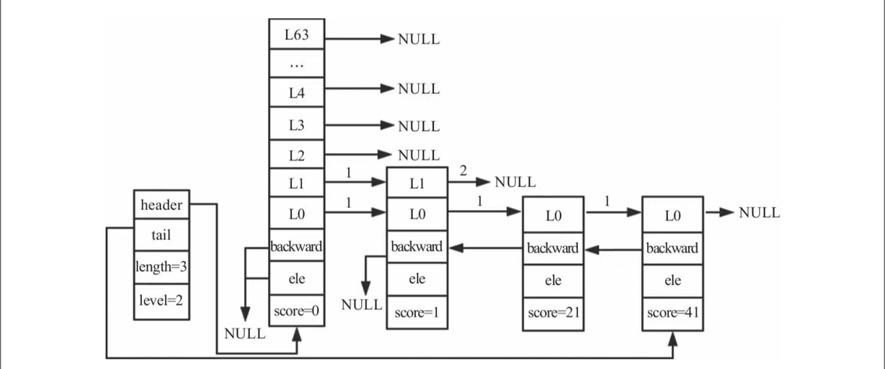

### Redis跳表

- Redis通过zslRandomLevel函数随机生成一个1～64的值，层数为随机层数，最大层数为64层。
  层数越高，新建的节点的概率越低，节点确定后便不会再进行修改。

- 跳跃表的插入
    - 插入的步骤为四步
        - 我们要找到插入的位置
        - 调整level的高度
        - 插入节点
        - 调整backward

- 跳跃表的删除
- 跳跃表的查找
- 跳跃表的遍历

用来描述和存储跳跃表, 从这个结构可以用O(1)的复杂度获取长度和高度信息

```c
    typedef struct zskiplist {
        # 跳跃表的头节点和尾节点,用来快速访问头尾节点
        struct zskiplistNode *header, *tail;
        # 跳跃表的长度[节点数的长度,不包含头节点]
        unsigned long length;
        # 跳跃表的高度
        int level;
    } zskiplist;
```

定义每个节点的结构

```c
    typedef struct zskiplistNode {
        // 存储了节点的元素值
        sds ele;
        // 存储了节点的分值
        double score;
        // 指向前一个节点的指针
        struct zskiplistNode *backward;
        // 指向当前节点所在层数的指针
        struct zskiplistLevel {
            // 存放指向各层链表后一个节点的指针（后向指针）
            struct zskiplistNode *forward;
            unsigned long span;// 表示当前的指针跨越了多少个节点
        } level[];
    } zskiplistNode;
```

### 跳跃表示例


### 跳跃表的创建过程

1. 声明跳跃表 `zsl` 给跳跃表分配内存
2. 创建头节点
3. 初始化头节点的, 头节点不存储任何值, 所以span为0, forward为NULL
4. 头节点默认层高为64层

```c
    /* Create a new skiplist. */
    zskiplist *zslCreate(void) {
        int j;
        zskiplist *zsl;
    
        zsl = zmalloc(sizeof(*zsl));
        zsl->level = 1;
        zsl->length = 0;
        # 初始化头节点score为0, ele为NULL
        zsl->header = zslCreateNode(ZSKIPLIST_MAXLEVEL,0,NULL);
        for (j = 0; j < ZSKIPLIST_MAXLEVEL; j++) {
            zsl->header->level[j].forward = NULL;
            zsl->header->level[j].span = 0;
        }
        zsl->header->backward = NULL;
        zsl->tail = NULL;
        return zsl;
    }
```

#### 节点的创建

节点的创建非常简单, 由于`zskiplistLevel`是柔性数组, 所以需要单独分配内存空间

```c
    zskiplistNode *zslCreateNode(int level, double score, sds ele) {
        zskiplistNode *zn =
            zmalloc(sizeof(*zn)+level*sizeof(struct zskiplistLevel));
        zn->score = score;
        zn->ele = ele;
        return zn;
    }
```